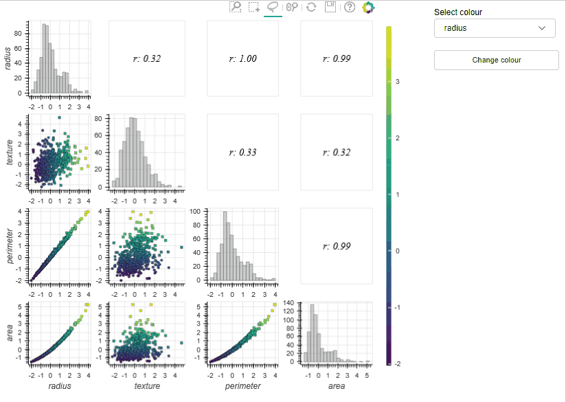

# 

MLViz is a suite of interactive visualisation tools to assist with the exploratory analysis of (high-dimensional) datasets.

It is based on the [Bokeh](https://bokeh.pydata.org/en/latest/) library and is developed to integrate with Jupyter notebooks so it can be used in existing exploratory analysis workflows.

Consider reading the [blog post](https://it-innovation.github.io/mlviz/)  describing the motivation behind the MLViz library.

Below you will see an example of the Draughtsman plot tool (a.k.a. a pair plot) implemented in MLViz. It demonstrates how interaction can allow a user to rapidly explore a large number of dimensions (by changing the colour of the data points) and perform real-time calculations on selected subsets of the data.

# Installation

MLViz is a wrapper around bokeh and sci-kit learn and developed to work directly with jupyter lab. It has the following requirements (and there base dependancies):

+ jupyterlab (0.35.6)
+ bokeh (1.0.4)
+ sklearn (0.20.3)
+ numpy (1.16.4)
+ umap-learn (0.3.8) 
+ numba (0.43.1)

Currently, the best way to install MLViz is to clone the repository and manually navigate to the mlviz directory containing the `setup.py` file and use pip to install the library by running the command:

- `pip install .`

If you don't use the setup.py file and install the dependancies manually (listed in requirements.txt file) you will also need to run the following commands in a command prompt after install:

- `jupyter labextension install jupyterlab_bokeh`
- `jupyter serverextension enable --py nbserverproxy`

which enable the bokeh and jupyter lab servers to communicate.

If there are problems with the install you may require a global [nodejs](https://nodejs.org/en/) install.

Currently MLviz has not been tested with other versions of listed packages and should not be considered stable.

## Acknowledgements

[MLViz](https://www.turing.ac.uk/research/research-projects/integrating-information-visualisation-machine-learning) was funded by the Alan Turing institute / EPSRC under the Strategic Priorities Fund, EPSRC Grant P/T001569/1.
