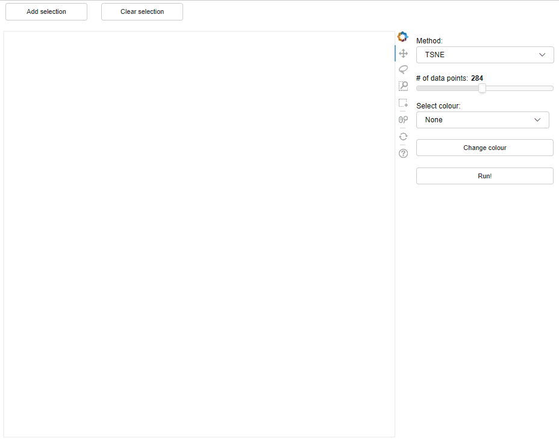
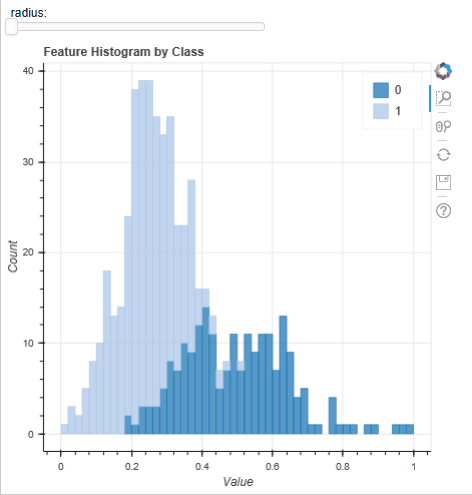
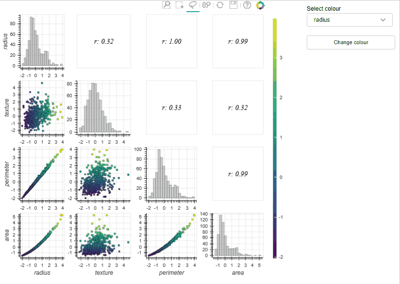

# Introduction to MLViz

A key stage of typical machine learning workflows is in the exploratory analysis of the available training data. The prime utility of this process is to gain a deeper insight into the data and allow an evaluation of the learning potential held in the training set. The process is typically iterative and begins with a high-level inspection of features, involving identifying any missing data and generating an imputation method for dealing with these. Generally, the training instance distributions of each feature is then investigated, with the aim of answering a range of questions, including:

-	Are any features highly correlated?
-	Which features are likely to be the most discriminative/predictive?
-	If relevant, what is the degree of class separability?
-	Can we generate new predictive features (i.e., feature engineering)?

The overall aim of the exploratory analysis is to glean information which may be of use if any additional data is collected (or acquired) or  in the modelling and reporting stages of a project  (e.g., having an understanding of what are the most important variables in a constructed predictor) and to improve the Data Readiness Level  (DRL) of the training set (generally aiming to take it from band B to band A) [X1], enabling a discriminative and structured feature set to be taken forward to the modelling stage. This stage is crucial to the machine learning workflow as by increasing the DRL and understanding subtle details data, it is likely the quality of the predictions will be improved and subsequent stages in the workflow will be quicker to optimize workflow as a result. Because the results of the exploratory analysis propagate through the machine learning workflow, there is motivation to develop tools and practices to improve the efficiency and accuracy of this process to increase the predictive ability of machine learning models as a whole.

The exploratory analysis process is iterative and highly interactive: data scientists will investigate and visualise the data using a range of different methods. Discoveries unique to the dataset (for example, that two features are highly correlated) will likely mean that the analyst will have to revisit another step of the exploratory analysis process (such as reselecting a different feature set if some are highly correlated). Currently, such an iterative process is often best facilitated by taking advantage of python ‘notebook’s (known as Jupyter notebooks – https://jupyter.org) which are flexible and allow rapid alterations to the workflow. Within these ‘notebooks’, analysts produce code to process their data and produce static visualisations to inspect key features of the data (see Yellowbrick for examples of visualisations used - https://www.scikit-yb.org/en/latest/gallery.html). With the large size and complexity of data sets, analysts can spend a lot of time writing code to inspect their data and can struggle to develop visualizations which are effective at exploring the training set and limit  the amount of expertise (such as, by engineering new discriminative features based on their domain knowledge) they can inject into the exploratory analysis process .

Arguably the most natural way to inspect data is to ‘handle’ and interact with it, as one would when solving a physical puzzle (such as a Rubik’s cube). The static visualisations currently used are somewhat restrictive in this regard (consider solving a Rubik’s cube without being able to touch it and with only static photos of each face) and need to be updated multiple times to explore the data in an interactive way and are arguably not the most efficient way to interrogate data. Adding a layer of interactivity to these visualisations would allow analysts to work much faster when investigating the data and potentially allow deeper insights to be gained from the data.

Several python packages are available for producing interactive visualisations (e.g., Plotly, Bokeh and, Altair) and those for visualisations with a Machine learning or statistical focus (e.g., Seaborn and Yellowbrick), however,  there are no packages which effectively combine the two. In this blog we introduce MLViz which aims to address this need: it ships interactive visualisations with a machine learning focus and will allow analysts more time inspecting their data and less time writing code to generate effective visualisations. As MLViz directly integrates with Jupyter notebooks, it can be dropped into existing ML workflows and means it can be adopted with little change to current practices. 

# Example tools

In the following, we describe and show examples of some of the currently available tools. MLViz is an experimental project (and still in development - https://github.com/it-innovation/mlviz), designed to showcase the potential in this area. One prime area of focus going forward is to provide interactivity when exploring high-dimensional data, as this kind of data is one where the productivity impact of MLViz will likely be the greatest.  However, we are interested in users to test the tools and appreciate any feedback going forward.

## Dimensionality reduction

Reducing the dimensionality of the feature space to two dimensions, while preserving as much as possible the structure of the high-dimensional space, is a common process in exploratory data analysis. This dimensionality reduction tool implemented in MLViz allows users to do this rapidly and extract observed clusters for investigation by other tools in the workflow to help identify how the extracted clusters are distributed in the high dimensional feature space. The below example shows how we use the tool to cluster the Wisconsin Breast Cancer Dataset (WBC - http://archive.ics.uci.edu/ml/datasets/Breast+Cancer+Wisconsin+%28Diagnostic%29). The tool shows there are no distinct clusters, but the target classes are relatively well separated. This demonstrates that our data has a relatively high DRL and we will likely be able to build a good classifier of the target using this dataset. 

## Feature histogram

A typical step in all ML workflows is visualisation the histograms of the features to look for ‘stand out’ features and class separability. This is normally done with an array of static figures  (https://machinelearningmastery.com/visualize-machine-learning-data-python-pandas/) but the tool implemented in MLViz allows for a user to rapidly plot a histogram and interactively change the feature plotted; as well as providing tools for zooming and panning the histogram. Below, using the WBC dataset we can quickly evaluate the feature distributions: the instances for each feature and for each target class appear roughly normally distributed. This suggests that a Gaussian mixture model [X2] may perform well on this dataset and it is worth spending time developing and evaluating such a model. Conversely, because the number of samples are small it unlikely a algorithm of greater complexity (such as a neural network) would perform as well.

## Draughtsman Plot 

Draughtsman plots (a.k.a pair plots) are often used in exploratory analysis to inspect the correlations between a large number of features and to check things like class separability. The MLViz implementation allows users to zoom and pan the plots and also select subsets of the training data interactively – the tool then automatically calculates key information on the selected data (e.g. correlation coefficient) and reactively presents this to the user. In the example below (using the WBC dataset) the draughtsmen plot allows us to rapidly detect linearly correlated features (i.e., radius and perimeter – which is of course supported by physical insight), so we can discard one of these features in our analysis. In addition to this, we can visualise the data in three dimensions (by changing the colour of the data sets) which can further help identify useful features. 

## Tool summary

In the previous examples we used some of the tools available in the MLViz library to explore the Wisconsin breast cancer database. The Dimensionality reduction tool allowed us to gain a rapid qualitive evaluation of the data readiness level of the data and demonstrate that the target classes are unlikely to be linearly separable in the high dimensional space. However, the distribution of the target classes clearly indicates we will be able to develop a well performing classifier on this dataset. The feature histogram tool allowed us to quickly evaluate the feature distributions, the appear approximately gaussian and can help motivate the use of certain models. Finally, the Draughtmen plot tool was extremely effective at highlighting correlated features, some of which can be removed, which could help speed up model development. Overall, the tools allowed us to gain a deep understanding of the dataset and in a time much faster than could be achieved with conventional tools.

Going forward, the MlViz project will aim to expand the range of available tools, with the focus on dealing with high dimensional data sets. 

[X1] N. D. Lawrence, Data Readiness Levels, arxiv:1705.02245 (2017)  
[X2] Gaussian Mixture Models, scikit-learn User guide, https://scikit-learn.org/stable/modules/mixture.html, accessed July 2019.
